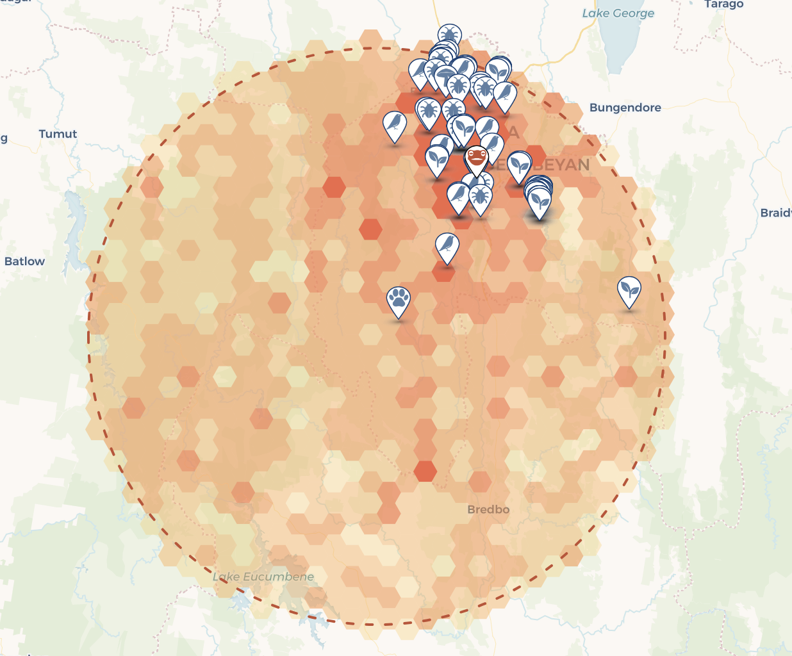
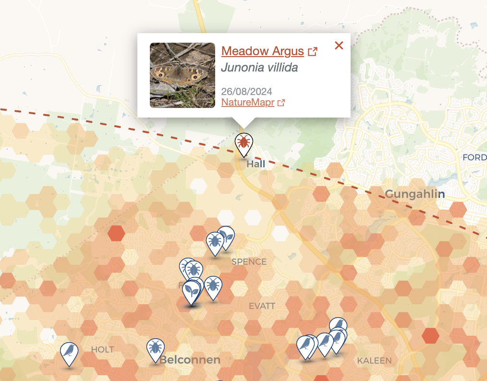
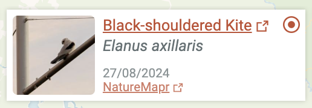
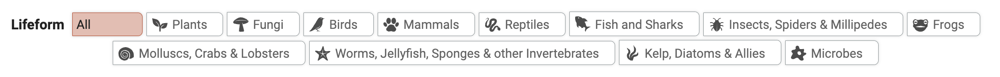
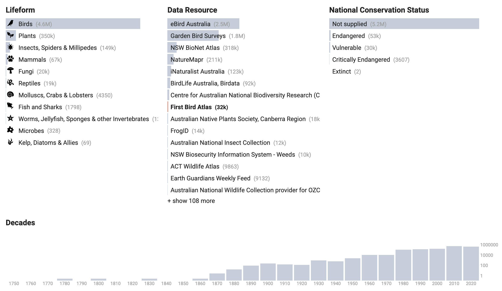
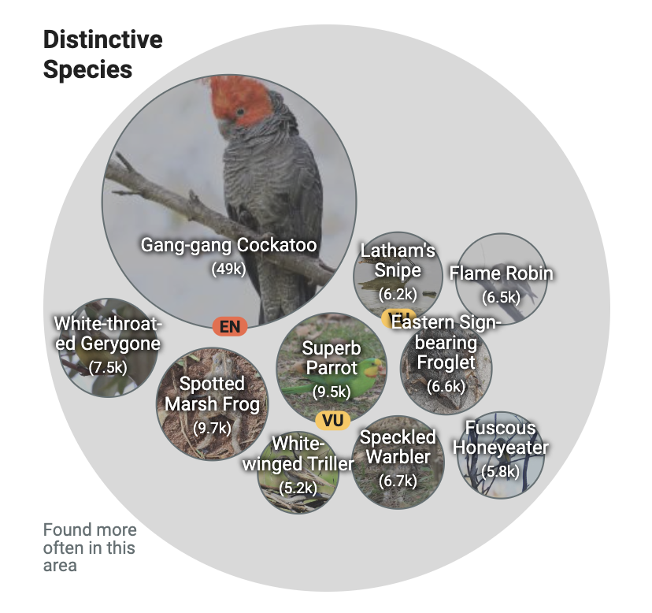

# Interface Elements

## Hex Map
- A visual language for showing the distribution of (arbitrarily) large numbers of observations on a map. This is required because otherwise the number of individual observations that can be shown is limited (by browser performance and API requests) to the order of 100-1000. 
- Compared to current approaches (eg dot distribution maps in species pages) the hex map is better able to show variation in distribution, though perhaps less effective in showing spatial extent. 
- The hex map is generated through a new ALA API call, and is adaptable (eg parameters for cell size and colours). 
- In the context of other biodiversity platforms it is also visually distinctive (eg iNaturalist uses a square density map). 
- Informed by research: Users gravitated to map-based representations but expressed concern when these were limited or constrained (eg by the limited numbers available through the API). The density map approach provides a visual language for showing all available data. 

## Map Markers
- Markers are used to show sample observations on the map
- They use icons to show the lifeform (_species group_) of the observation
- They are clickable to show an _observation tile_
- Informed by research: users responded to and commented on the data story experiments with using a diversity of symbols to represent species groups. Users also expected to be able to click on markers to see additional information

## Sample Observations
- The interface shows a set of recent observations matching the current focus or query. These samples serve as indicators and examples of data that provide rich “clues” about the current focus
- Recency is privileged to emphasise the dynamic nature of data in the ALA
- Samples are shown as horizontally scrolling observation tiles at the foot of the map as well as in map markers

## Observation Tiles
- Tiles provide information on sample observations: Common name, scientific name, date of observation, data resource and national conservation status
- Common name links to the observation detail in the ALA
- Data resource name links to ALA data resource information
- “Focus” icon focuses the interface on this species (in either species or data view modes)
- Image triggers large modal image / observation display
- Informed by research: the makeup of the tiles reflects users' interests in the sources of data. It also adopts an inclusive approach, privileging common names over scientific names and showing images by default.

## Species Groups
- The Lifeform dimension is used throughout the interface as a way to both represent biodiversity and enable refinement and exploration of observations. 
- It applies a species grouping that is based on draft ALA guidance, with further simplication and a flat structure
- The aim of these groups is to segment ALA occurrences into groups that are broadly accessible:
	- Recognisable by non-experts
	- Manageable in number (twelve groups)
	- Flat structure, enabling them to be used in facets (ie groups are non-overlapping)
- Icons for species groups enable compact visual encoding (eg in map markers)
- Groups and icons offer a way to surface and emphasise the diversity of data in the ALA 
- Informed by research: inclusive, accessible representations for a diverse audience.

## Facets

- Facets provide a flexible overview of any query / selection, revealing distribution and relationships between data features
- Dimensions were chosen based on themes arising from our user research:
	- Lifeform, focusing on observed taxa and reflecting the key value of biodiversity
	- Data resource, reflecting the diverse production of data aggregated in the ALA, and the diverse constituencies, stakeholders and perspectives this reflects (museum collections, citizen science, biosecurity, land management and conservation)
	- Conservation status, reflecting a key concern of users we worked with. National conservation status is used because it provides a single straightforward set of categories. This does have the side-efect of excluding species that are classified in State or Territory but not national lists.  
	- Decades provide a useful way to reveal the historical dimension of ALA data, for example showing the change in data resources over time
- Facet navigation enable rapid refinement of the selection and exploration of relationships between dimensions (eg between data resource and lifeform)

## Species Bubbles
- Species bubbles provide a way to reveal species with specific relevance to the current spatial focus: common species, distinctive species, and threatened species
- The bubble layout provides a way to show names, counts, images and conservation status in a non-heirarchical layout
- Common species shows the top ten most frequently occurring species in the current selection
- Threatened species shows the top ten most frequently occurring species in the current selection, with any national conservation status
- Distinctive species uses a statistical calculation to surface species that occur more frequently in the current spatial focus, than they do across the whole ALA. This provides a way to discover species that are neither common nor widespread, but are characteristic of the current focused area. Notably threatened species often appear in the distinctive species list.
- Informed by research: reflecting users' interests in place and species, as well as conservation.

